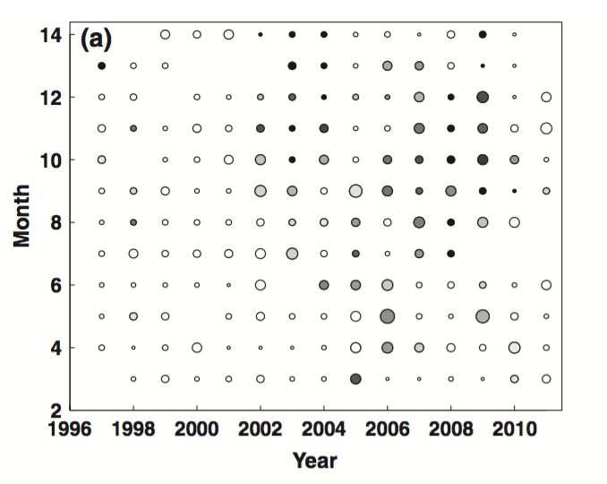
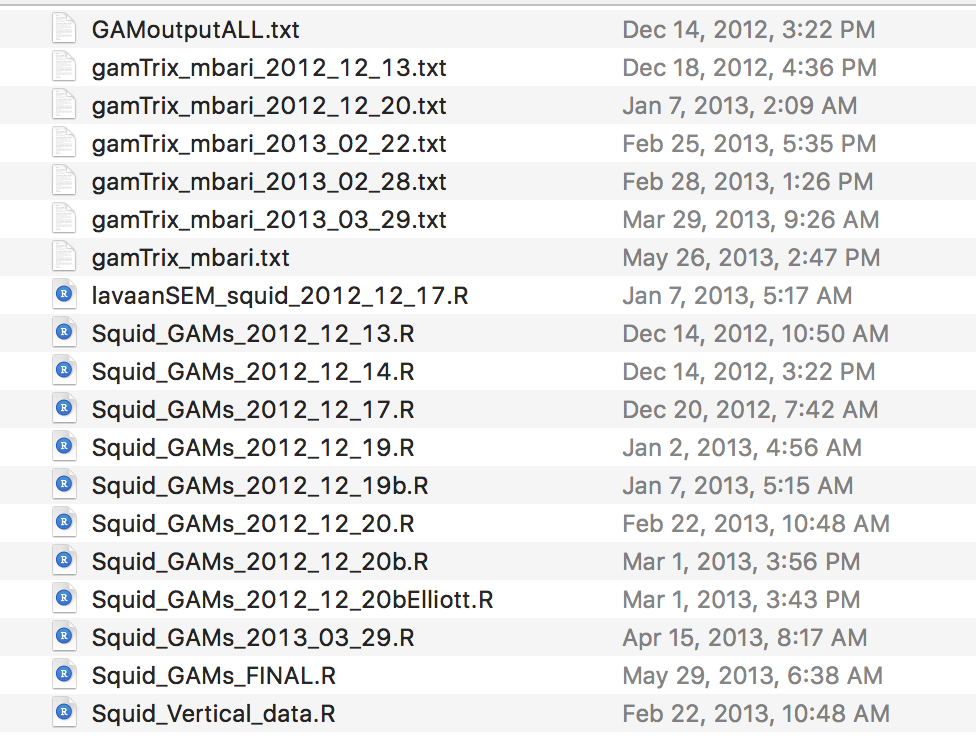

# Recreate a figure from grad school

What does it take?


I'm trying to reproduce this figure from [Stewart et al. 2014](http://www.sciencedirect.com/science/article/pii/S0967064512000860) in R: 


## 
```{r setup, message=FALSE}
## libraries
library(tidyverse)
library(htmlwidgets)
library(plotly)
```

Tried to read in file as is; spaces separate column header names; tabs separate data.
```{r, message=FALSE, warning=FALSE}
## filename
f <- '~/Dropbox/FATE_2012/FATE_Dgigas_Code_Data/FATE_Dgigas_data/semTrixMultiFull.txt'

d <- readr::read_delim(f, delim = ' ') # head(d)
```

Must read data and headers separately
```{r, message=FALSE, warning=FALSE}
## data
d <- readr::read_delim(f, delim = '\t', col_names=FALSE, skip=1, trim_ws=TRUE) # head(d)

## col names
d_names <- readr::read_delim(f, delim = ' ', col_names=TRUE, trim_ws=TRUE) %>%
  colnames(); # d_names

## combine
names(d) <- d_names[1:dim(d)[2]] # head(d); tail(d); str(d)
```

...but these data don't have month/year. Let's try again. 

Trying to see where `gamTrix.txt` was created; traced to /Users/julialowndes/Dropbox/FATE_2012/FATE_Dgigas_Code_Data/FATE_Dgigas_code/GAM_manage.m. 



```{r, message=FALSE}
## filename
f <- '~/Dropbox/FATE_2012/FATE_Dgigas_Code_Data/FATE_Dgigas_data/gamTrix_mbari.txt'

## data
d <- readr::read_delim(f, delim = '\t', col_names=FALSE, skip=1, trim_ws=TRUE) # head(d)
   
## col names
d_names <- readr::read_delim(f, delim = ' ',col_names=TRUE, trim_ws=TRUE) %>%
  colnames() # d_names

## combine
names(d) <- d_names[1:dim(d)[2]] # head(d); tail(d); str(d); summary(d)
```

Some metadata gleaned from GAM_manage.m, where this file was created: 

- `Squid = DSER`, which from my thesis means 'Downcast session encounter rate. 
- `SqCount = sum(SqdepthbinscountDownSess)'` (transposed); squid count in depth bins
- `Effort = DurDownSess` 

wrangle and plot

try to recreate this for frequency of occurrance: 
From /Users/julialowndes/Dropbox/Thesis/Dg_Abundance/MBARI_Dg/sem_figsFinal.m: 

```
ScatterMatrixA = [];
for y = 1:length(semTrixSqYrUni)
    ylog = semTrix(:,14) == semTrixSqYrUni(y);
    for m = 1:length(semTrixSqMoUni)
        mlog = semTrixSqMoUni(m) == semTrix(:,13);
        my = ylog + mlog;
        mylog = my == 2;
        SPDtemp = semTrix(mylog,2);
        ScatterMatrixA = [ScatterMatrixA; semTrixSqYrUni(y) semTrixSqMoUni(m) length(SPDtemp)...
            length(SPDtemp(SPDtemp>0)) (length(SPDtemp(SPDtemp>0))/length(SPDtemp))*100]; 
    end
end
```

```{r, message=FALSE}

d <-  d %>% 
  mutate(Freq = ifelse(SquidCount>0, 1, 0))

dw <- left_join(
  d %>%
    dplyr::group_by(SqMonth, SqYear) %>%
    summarize(ROV_count = n()), 
  d %>%
    dplyr::group_by(SqMonth, SqYear) %>%
    summarize(ROV_count_SqView = sum(Freq)), 
  by=c('SqMonth', 'SqYear')) %>%
  mutate(FreqOcc = ROV_count_SqView / ROV_count)
         

  

## bubble plot - this works
g <- ggplot(dw, aes(SqYear, SqMonth, size=ROV_count, color=FreqOcc))
g + geom_count() 


## but try this
g <- ggplot(dw, aes(SqYear, SqMonth, size=ROV_count, color = FreqOcc))
g + geom_count() #+
  # scale_fill_grey( start = 0, end = 8, na.value = "red")

# COME BACK HERE AND LEARN GGPLOT

```

From /Users/julialowndes/Dropbox/Thesis/Dg_Abundance/MBARI_Dg/sem_figsFinal.m: 

```
figure; hold on;
colormap(flipud(gray))
scatter(ScatterMatrix(:,1), ScatterMatrix(:,2), ScatterMatrix(:,3)*10, 'k')
scatter(ScatterMatrix(ScatterMatrix(:,5)>0,1), ScatterMatrix(ScatterMatrix(:,5)>0,2), ...
    ScatterMatrix(ScatterMatrix(:,5)>0,3)*10, ScatterMatrix(ScatterMatrix(:,5)>0,5), 'filled')
set(gca, 'XLim', [min(unique(ScatterMatrix(:,1)))-1 max(unique(ScatterMatrix(:,1)))])
xlabel('SqYear ', 'FontSize', 14, 'FontWeight', 'bold');
ylabel('SqMonth ', 'FontSize', 14, 'FontWeight', 'bold')
% title('ROV dives and Humboldt squid occurrence',...
%     'FontSize', 16, 'FontWeight', 'bold')
fixfig
FigName = ['Dive_Squid_BubbleplotFiltered.pdf'];
annotate_JS(Mfilename, gcf, FigName)
% print('-dpdf', [DirFATEsem '/_figs/' FigName]);
```
