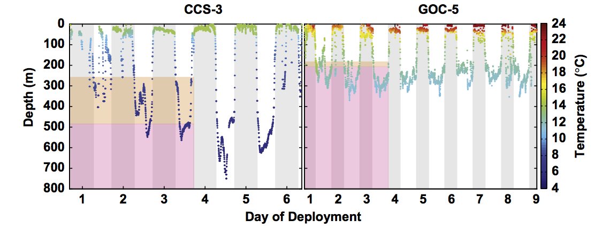

```{r setup, include=FALSE}
knitr::opts_chunk$set(echo = TRUE)
```

## Goal: 

Let's recreate this figure from [Stewart et al. 2014](http://www.sciencedirect.com/science/article/pii/S0967064512000860) in R instead of Matlab: 



This means that we're going to start of plotting Day v. Depth, with color as an overlay to represent temperature. 

## Setup

Load appropriate libraries. `tidyverse` is a meta-package (see [tidyverse.org](https://www.tidyverse.org/)). It will load `dplyr` and `ggplot2`, which we will use a lot. We'll also use `lubridate`.

```{r, message=FALSE}
library(tidyverse)
library(lubridate)
```


## Read in Data

And get a sense of 
```{r, message=FALSE}
d <- readr::read_csv('data/83052-Series.csv', skip = 3)

## little peek of first 6 rows (default)
head(d)

## little peek of last 10 rows 
tail(d, 10)

## quick stats: summary
summary(d)

## quick stats: structure
str(d)
```


## Plot something

Let's just see where we are. 

In RStudio, go to Help > Cheatsheets > Data Visualization with ggplot2. We can use the basic structure of ggplot to give it data and plot points. Let's look at Day v. Depth. 

```{r, message=FALSE}
ggplot(data = d) +
  geom_point(mapping = aes(x = Day, y = Depth))
```

OK so we've got some wrangling to do first!

We'll need to: 

- use functions from the `lubridate` package to combine Date and Time so that we can have a continuous plot
- color by temperature
- further tweeks. 

How we'll do it: 

1. read [R for Data Science](http://r4ds.had.co.nz) Chapters 1-3 so that you're familiar with ggplot2
1. read [OHI data science training](http://ohi-science.org/data-science-training/github-rstudio.html) Chapters 4-5 (and please tell me if it doesn't make sense!! It's a work in progress!)
- use the Cheatsheet and play around!

whitney, is adding more....
## Some notes about dates and time:

- Use dplyr to form a date-time by using the following function dmy_hms() or make_datetime(year, month, day, hour, second)

- I thought about trying this function but didnt end up using it 
`parse_datetime()`

- I dont think I needed to unclass the date field since its just a character string
unclass(d$Date)

Making a new column of combined date and time and calling it dt:

```{r}
d$date_time = dmy_hms(paste(d$Day, d$Time))
dt <-d$date_time

## and here's how you'd do this with the tidyverse, within the d dataframe:
d <- d %>%
  mutate(DateTime = lubridate::dmy_hms(paste(Day, Time)))
```

## Now we can try to plot depth based on our combined day and time

```{r, message=FALSE}
ggplot(data = d) +
  geom_point(mapping = aes(x = DateTime, y = Depth, color = Temperature))
```

## Very cool! 
Now we can flip the y axes (since it's customary to make the top of the graph like the surface of the ocean)
```{r}
ggplot(data = d) +
  geom_point(mapping = aes(x = DateTime, y = Depth, color = Temperature)) +
  scale_y_reverse()
```

